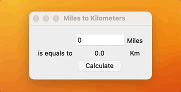
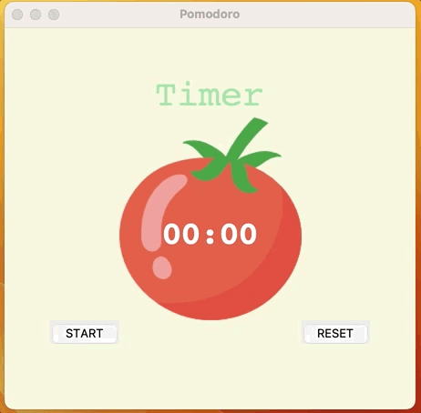

<a name="readme-top"></a>


<div align="center">
<!-- Title: -->
<h1><a href="https://github.com/skthati/python_tkinter">tkinter</a> - Python </h1>
</div>

<!-- Table of contents -->
<hr>
<hr>
<ol>
    <li><a href="#tkinter-python">Python Basics</a></li>
    <li><a href="#miles-to-kms">Miles to Kms</a></li>
    <li><a href="#bloopers">Bloopers</a></li>
</ol>
<hr>
<hr>


# tkinter python
 All basic code syntax 

```Python
import tkinter

window = tkinter.Tk()
window.title("Hello World")
window.minsize(600, 500)


my_label = tkinter.Label(text="Hello World!", font=("vardana", 23, "bold"))
my_label.pack()
tkinter.mainloop()
```

<hr>

## Multiple Args

```Python
'''Defination showcasing how to pass multiple arguments'''
lst = []


def add(*args): # "*" is main here. with * before variable, we can pass any number of arguments to Defination
    for i in args:
        lst.append(i)
        # print(type(i))
    return sum(lst)


def add1(*args):
    x = 0
    for i in args:
        x += i
    return x


print(add(2, 3, 4, 5, 6))

print(add1(1, 2, 3, 4, 5, 6))
```

<hr>

## Keyword Args kwargs

```Python
'''kwargs are multiple keyword arguments.'''
'''kwargs are converted as dictionaries.'''


def calculate(n = 2, **kwargs):
    print(kwargs)
    ''' One way of calling dict is below'''
    # for key, value in kwargs.items():
    #     print(key)
    #     print(value)
    '''Or we can call directly'''
    print(n + kwargs["sum"])
    print(n * kwargs["multiply"])


calculate(3, sum=3, multiply=5)

# print(calculate())
```

<hr>
## Keyword Args class

```Python
class Car:
    def __init__(self, **kwargs):
        # Below two lines can give error if you haven't passed any values.
        # self.make = kwargs["make"]
        # self.model = kwargs["model"]
        self.make = kwargs.get("make")
        self.model = kwargs.get("model")


my_car = Car(make="Toyota", model="Aqua")
print(my_car.make, my_car.model)

```

## Miles to Kms <a name="miles-to-kms "></a>

Using Tkinter, small calculator which converts miles to kms.



```Python

from tkinter import *

def miles_to_km():
    miles = float(miles_input.get())
    km = miles * 1.609
    result_label.config(text=f"{km}")


window = Tk()
window.title("Miles to Kilometers")
window.config(padx=15, pady=15)

miles_input = Entry(width=10)
miles_input.grid(column=1, row=0)

miles_label = Label(text="Miles")
miles_label.grid(column=2, row=0)

equals_to = Label(text="is equals to")
equals_to.grid(column=0, row=1)

result_label = Label(text="0")
result_label.grid(column=1, row=1)

km_label = Label(text="Km")
km_label.grid(column=2, row=1)

calculate_button = Button(text="Calculate", command=miles_to_km)
calculate_button.grid(column=1, row=2)

mainloop()
```

<hr>


Test1  
## Pomodoro <a name="pomodoro"></a>
Pomodoro, Simple timer app used to focus on work and break balance. For every 25min take a break of 5 min and After completing 4 times, you are awarded with 30min break.



Code
```Python
from tkinter import *
import math
# ---------------------------- CONSTANTS ------------------------------- #
PINK = "#e2979c"
RED = "#e7305b"
GREEN = "#9bdeac"
YELLOW = "#f7f5dd"
FONT_NAME = "Courier"
WORK_MIN = 25 #25
SHORT_BREAK_MIN = 5 #5
LONG_BREAK_MIN = 20 #20
REPEAT = 0
timer = None

# ---------------------------- TIMER RESET ------------------------------- # 

def reset_timer():
    window.after_cancel(timer)
    canvas.itemconfig(timer_text, text="00:00")
    title_label.config(text="Timer")
    check_marks.config(text="")
    global REPEAT 
    REPEAT = 0

# ---------------------------- TIMER MECHANISM ------------------------------- # 
def start_timer():
    global REPEAT
    REPEAT += 1

    work_sec = WORK_MIN * 60
    short_break_sec = SHORT_BREAK_MIN * 60
    long_break_sec = LONG_BREAK_MIN * 60

    if REPEAT % 8 == 0:
        count_down(long_break_sec)
        title_label.config(text="Break", fg=RED)
    elif REPEAT % 2 == 0:
        count_down(short_break_sec)
        title_label.config(text="Break", fg=PINK)
    else:
        count_down(work_sec)
        title_label.config(text="Work", fg=GREEN)

# ---------------------------- COUNTDOWN MECHANISM ------------------------------- # 
def count_down(count):
    count_min = math.floor(count / 60)
    count_sec = count % 60

    if count_sec < 10:
        count_sec = f"0{count_sec}"

    canvas.itemconfig(timer_text, text=f"{count_min}:{count_sec}")
    if count > 0:
        global timer
        timer = window.after(1000, count_down, count-1)
    else:
        start_timer()
        mark = ""
        work_sessions = math.floor(REPEAT/2)
        for _ in range(work_sessions):
            mark += "✔"
        check_marks.config(text=mark)


# ---------------------------- UI SETUP ------------------------------- #

window = Tk()
window.title("Pomodoro")
window.config(padx=50, pady=50, bg=YELLOW)

title_label = Label(text="Timer", fg=GREEN, bg=YELLOW, font=(FONT_NAME, 40))
title_label.grid(column=1, row=0)

canvas = Canvas(width=200, height=224, bg=YELLOW, highlightthickness=0)
tomato_image = PhotoImage(file='pomodoro/tomato.png')
canvas.create_image(100, 112, image=tomato_image)
timer_text = canvas.create_text(100, 130, text="00:00", fill="white", font=(FONT_NAME, 35, "bold"))
canvas.grid(column=1, row=1)

start_button = Button(text="START", command=start_timer, highlightthickness=0)
start_button.grid(column=0, row=2)

reset_button = Button(text="RESET", highlightthickness=0, command=reset_timer)
reset_button.grid(column=2, row=2)

check_marks = Label( bg=YELLOW, fg=GREEN)
check_marks.grid(column=1, row=3)

mainloop()
```


<p align="right">(<a href="#readme-top">back to top</a>)</p>
<hr>  


<!--
```Python

``` 
-->
<!-- 

Test1  
## Test <a name="test"></a>
Test Test

1. Code
    ```Python
    sc.onkey(key="Up", fun=up_move)
    sc.onkey(key="Right", fun=right_move)
    sc.onkey(key="Left", fun=left_move)
    sc.onkey(key="Down", fun=down_move)
    ```

2. Output

    

<p align="right">(<a href="#readme-top">back to top</a>)</p>
<hr>  


-->

